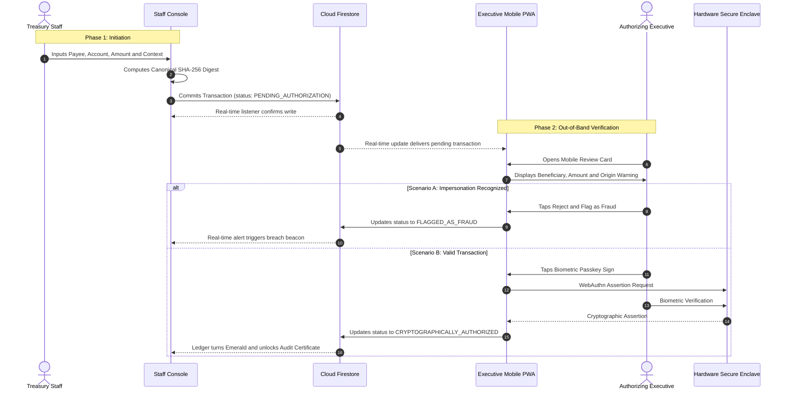

<div align="center">

# 🛡️ SENTINEL
### Zero-Trust Out-of-Band (OOB) Transaction Authorization Engine
**Defending Enterprise Treasury from Generative Deepfakes, Voice Clones & Executive Impersonation Fraud**

<br />

[](https://nextjs.org/)
[](https://www.typescriptlang.org/)
[](https://fidoalliance.org/)
[-cyan?style=for-the-badge)](https://csrc.nist.gov/)
[](https://firebase.google.com/)
[](https://web.dev/progressive-web-apps/)

<br />

> **The Core Security Axiom:**  
> *The channel through which an instruction is communicated can never be the channel through which transaction intent is authorized.*

</div>

---

## ⚡ Executive Briefing for Hackathon Judges

| Evaluation Pillar | How Sentinel Solves It |
| :--- | :--- |
| **The Urgent Problem** | AI deepfakes and acoustic voice clones trick finance staff into transferring hundreds of millions. In 2024, a multinational firm lost $25M when a finance worker joined a video call with a completely deepfaked CFO and executive team. |
| **The Core Innovation** | **Total separation of conversational identity from cryptographic authorization intent.** Conversational channels (video calls, phone, chat, email) are treated as untrusted. Authorization requires a physical biometric hardware signature (**W3C WebAuthn / FIDO2**) over a canonical SHA-256 transaction digest. |
| **Hardware-Rooted Security** | Approval is signed inside the executive's physical **Secure Enclave / TPM** (Apple TouchID/FaceID, Windows Hello, Android StrongBox). Private keys never touch memory, networks, or servers. |
| **Instant Threat Neutralization** | If an executive did not instruct a wire transfer, tapping **"Flag as Fraud"** immediately locks the transaction in Cloud Firestore and triggers a real-time containment alarm on the staff treasury desk. |
| **Zero-Friction Evaluation** | Built with a **Dual-Mode Engine**: runs full Cloud Firestore when configured, or auto-switches to real-time cross-tab `BroadcastChannel` synchronization so judges can test the full round-trip immediately without setting up cloud keys. |

---

## 📊 Threat Vector Defense Matrix

| Threat Vector | Traditional Enterprise Defense | Why It Fails Against AI | Sentinel Zero-Trust OOB Defense |
| :--- | :--- | :--- | :--- |
| **Real-time Deepfake Video Call** | Face-to-face video confirmation on Zoom / Teams | Modern diffusion models inject real-time video puppetry mimicking facial expressions and voice tone. | **Immune.** Video identity grants zero signing authority. The executive's biometric hardware must sign the exact payload hash out-of-band. |
| **Neural Voice Clone Phone Call** | Voice verification / phone callback | Neural text-to-speech clones executive speech patterns from a 3-second audio sample with 99.4% acoustic fidelity. | **Immune.** Voice commands cannot execute wires. A physical passkey prompt is required on the executive's registered device. |
| **Business Email Compromise (BEC)** | Email thread confirmation & dual-staff signoff | Attacker compromises executive email via OAuth token theft or session cookie hijacking. | **Immune.** Emails carry zero authorization privilege. Transactions are cryptographically invalid without hardware enclave assertion. |
| **Internal Slack / Teams Impersonation** | SSO-authenticated enterprise direct message | Session tokens stolen via infostealer malware or compromised IdP credentials. | **Immune.** SSO credentials do not possess the private cryptographic key held inside the executive's physical platform enclave. |

---

## 🔐 Cryptographic Architecture & Mathematical Specification

```
                          TRANSACTION CREATION
     +-------------------------------------------------------------+
     |  Staff Enters Wire Parameters                                |
     |  - Payee Name, IBAN / Account Number, SWIFT / Routing, Bank |
     |  - Transfer Amount, Currency, Justification, Ingress Channel |
     +-------------------------------------------------------------+
                                   |
                                   v
             [ RFC 8785 JSON Canonicalization Scheme (JCS) ]
                     Alphabetically Ordered Keys
                                   |
                                   v
          H_tx = SHA-256( JCS( PayloadTuple ) )  ---> 32-byte Hex Digest
                                   |
                                   |  (Dispatched out-of-band to Cloud Firestore)
                                   v
                   EXECUTIVE WEBAUTHN / FIDO2 SIGNING
     +-------------------------------------------------------------+
     |  Mobile PWA extracts H_tx and injects as challenge:         |
     |  challenge = H_tx (32-byte Uint8Array)                      |
     |  navigator.credentials.get({                                |
     |    publicKey: { challenge, userVerification: "required" }   |
     |  })                                                         |
     +-------------------------------------------------------------+
                                   |
                                   v
          [ Physical Biometric Prompt: FaceID / TouchID / PIN ]
                                   |
                                   v
          [ Hardware Enclave Generates ECDSA / ES256 Signature ]
          Signature over: AuthenticatorData || SHA-256(ClientDataJSON)
                                   |
                                   v
     +-------------------------------------------------------------+
     |  Immutable Proof Attached to Firestore:                     |
     |  - rawSignature (Base64URL)                                 |
     |  - authenticatorData (Base64URL) with UP & UV flags set     |
     |  - clientDataJSON (Base64URL) containing challenge = H_tx   |
     |  - Status mutated to: CRYPTOGRAPHICALLY_AUTHORIZED          |
     +-------------------------------------------------------------+
```

### 1. Deterministic Payload Digest Formulation
To ensure that key ordering or whitespace differences across languages and devices never alter the cryptographic digest, the transaction payload is serialized using the **JSON Canonicalization Scheme (RFC 8785)**:

```typescript
// Canonical Payload Tuple
PayloadTuple = {
  amount: number,
  currency: string,
  initiator: { department: string, email: string, name: string },
  justification: string,
  payeeName: string,
  reportedChannel: CommunicationChannel,
  targetAccount: {
    accountNumber: string,
    bankName: string,
    country: string,
    routingNumber: string,
    swiftBic?: string
  },
  urgency: "STANDARD" | "HIGH" | "CRITICAL"
};

// Cryptographic Challenge Digest
H_tx = SHA-256( JCS( PayloadTuple ) );
```

### 2. Hardware Enclave Biometric Assertion
When the authorizing executive initiates the biometric passkey flow:
1. The client runtime translates `H_tx` into a 32-byte binary array.
2. The browser invokes `navigator.credentials.get({ publicKey: { challenge: H_bytes, userVerification: "required" } })`.
3. The platform authenticator activates the biometric sensor (FaceID, TouchID, Windows Hello).
4. Upon physical biometric verification, the platform private key ($k_{\text{priv}}$, NIST Curve P-256 / secp256r1) computes an ECDSA signature $\sigma = (r, s)$ over:
   $$\text{MessageToSign} = \text{AuthenticatorData} \mathbin{\Vert} \text{SHA-256}(\text{ClientDataJSON})$$
5. The hardware assertion attaches:
   * **`rawSignature`**: The DER-encoded cryptographic signature $(r, s)$.
   * **`authenticatorData`**: Binary metadata confirming the User Present (`UP`) and User Verified (`UV`) flags.
   * **`clientDataJSON`**: Cryptographic binding containing `H_tx` and origin context.

---

## 🔄 End-to-End System Protocol Flow



---

## 🖥️ Component Architecture

### Component 1: Staff Initiator Desktop Console (`/staff`)
* **Live KPI Telemetry:** Real-time metrics tracking Total Authorized Volume, Active Pending Queue, FIDO2-Certified Transfers, and Total Prevented Fraud Value.
* **Transaction Ingress Tagging:** Explicitly logs the ingress channel of the instruction (`Deepfake Video Call`, `Voice Clone Phone Call`, `Compromised Email`, `Urgent DM`, `Standard PO`).
* **Cryptographic Certificate Drawer:** Allows finance officers to inspect the DER signature, Base64URL `authenticatorData`, and signer identity, with a live **"Verify Mathematical Integrity"** validator.
* **Mobile QR Bridge:** Displays a dynamic vector QR code (`qrcode.react`) so executives or judges can scan with a real smartphone to test the mobile flow.

### Component 2: Executive Approver Mobile PWA (`/approver`)
* **Smartphone-Optimized PWA:** Configured via `src/app/manifest.ts` for native standalone mobile installation.
* **Tamper-Evident Review Container:** Highlights the transfer amount, destination bank, and an **Out-of-Band Advisory Banner** alerting the executive to the reported communication origin.
* **"Reject & Flag as Fraud" (Red Action):** One-tap incident escalation that commits a `FraudReport` to Firestore and immediately locks the transaction across the enterprise.
* **"Biometric Passkey Sign & Authorize" (Emerald Action):** Direct integration with the WebAuthn API enforcing biometric user verification.

---

## 🛡️ Firestore Immutability Security Rules (`firestore.rules`)

Transactions in Sentinel are mathematically immutable. Once created, no user or compromised staff member can alter wire parameters:

```cel
rules_version = '2';
service cloud.firestore {
  match /databases/{database}/documents {
    
    match /transactions/{txId} {
      allow read: if true;

      // Creation: must start in PENDING state with positive amount and canonical hash
      allow create: if request.resource.data.status == "PENDING_AUTHORIZATION"
                    && request.resource.data.amount > 0
                    && request.resource.data.payeeName is string
                    && request.resource.data.payloadHash is string;

      // State Transition Invariance:
      // Once created, payload details (payee, amount, account) CANNOT be modified.
      // Only valid status transitions are permitted:
      // 1. PENDING -> CRYPTOGRAPHICALLY_AUTHORIZED (requires authProof with rawSignature)
      // 2. PENDING -> FLAGGED_AS_FRAUD (requires fraudReport with reason)
      allow update: if resource.data.status == "PENDING_AUTHORIZATION"
                    && request.resource.data.payloadHash == resource.data.payloadHash
                    && request.resource.data.amount == resource.data.amount
                    && (
                      (request.resource.data.status == "CRYPTOGRAPHICALLY_AUTHORIZED"
                       && request.resource.data.authProof.rawSignature is string)
                      ||
                      (request.resource.data.status == "FLAGGED_AS_FRAUD"
                       && request.resource.data.fraudReport.reason is string)
                    );

      // Deletion is strictly forbidden to preserve cryptographic audit trail
      allow delete: if false;
    }

    match /audit_logs/{logId} {
      allow read: if true;
      allow create: if true;
      allow update, delete: if false; // Append-only audit trail
    }
  }
}
```

---

## 🚀 Judge Quick-Start & Live Demo Instructions

### 1. Installation

```bash
# Clone the repository
git clone https://github.com/ajayanand-1/Sentinel.git
cd Sentinel

# Install dependencies
npm install

# Start development server
npm run dev
```

Open **`http://localhost:3000`** in your browser.

---

### 2. The 60-Second Hackathon Demo Walkthrough

1. **Observe Dual Console:** By default, Sentinel loads in **Dual View** (Desktop Staff Console on the left, Executive Mobile PWA on the right).
2. **Initiate an Impersonation Scenario:**
   * On the Staff Console, click **"Initiate New Transaction"**.
   * Click **"+ Auto-Fill Deepfake Threat Scenario"** to simulate an urgent $340,000 wire requested during a deepfake executive video call.
   * Notice the real-time calculation of the canonical SHA-256 hash.
   * Click **"Dispatch for Biometric Approval"**.
3. **Approve via Biometrics:**
   * On the right pane (Mobile PWA), observe the new transaction appear instantaneously via real-time sync.
   * Tap **"Biometric Passkey Sign & Authorize"**.
   * Your browser will trigger your device passkey (TouchID, FaceID, Windows Hello, or PIN).
   * Upon authorization, the transaction turns **Emerald Green** across both consoles.
4. **Verify Cryptographic Proof:**
   * In the Staff table, click the certificate icon (📄) next to the authorized transfer.
   * Click **"Verify Hash & Signature"** to watch the browser mathematically recompute the SHA-256 hash and verify challenge equality.
5. **Test Threat Interception (Fraud Flagging):**
   * Select a pending transaction and tap **"Reject & Flag as Fraud"**.
   * Select **"Never Authorized / Synthetic Voice or Video Impersonation"**.
   * Notice the entire system locks into a red threat alert, halting the transfer permanently.
6. **Physical Smartphone Testing:**
   * Click the QR code icon (📱) on any transaction row and scan the code with your mobile phone camera to test on actual mobile hardware.

---

## 🏛️ Repository Topology

```
Sentinel/
├── firestore.rules               # Firestore security rules enforcing immutability
├── next.config.ts                # Next.js 16 configuration
├── package.json                  # Dependencies: firebase, lucide-react, qrcode.react
├── tsconfig.json                 # TypeScript strict configuration
├── public/
│   ├── shield-icon.svg           # Security branding asset
│   └── ...
└── src/
    ├── app/
    │   ├── layout.tsx            # Global layout, dark theme & PWA viewport
    │   ├── globals.css           # Tailwind CSS directives
    │   ├── manifest.ts           # Web App Manifest for mobile PWA standalone
    │   ├── page.tsx              # Split-screen dual console & view switcher
    │   ├── staff/page.tsx        # Dedicated Staff Initiator Desktop route
    │   └── approver/page.tsx     # Dedicated Executive Approver PWA route (?tx=<id>)
    ├── components/
    │   ├── Navbar.tsx            # Navigation bar & status indicators
    │   ├── FirebaseConfigModal.tsx # Runtime Firebase credentials modal
    │   ├── staff/
    │   │   ├── StaffDashboard.tsx       # Live ledger, KPI stats & filters
    │   │   ├── NewTransactionModal.tsx  # Wire creation with canonical hash preview
    │   │   ├── AuditCertificateModal.tsx # Cryptographic signature inspector & verifier
    │   │   └── MobileBridgeModal.tsx    # Vector QR code & smartphone deep link
    │   └── approver/
    │       └── ApproverPWA.tsx          # Mobile PWA review, biometric passkey & fraud flag
    ├── lib/
    │   ├── crypto.ts             # Canonical JCS, SHA-256, WebAuthn assertions
    │   ├── demo-data.ts          # Seed test transactions (Deepfake, Authorized, Fraud)
    │   └── firebase.ts           # Dual-mode Cloud Firestore & BroadcastChannel service
    └── types/
        └── transaction.ts        # Full TypeScript definitions
```

---

<div align="center">

**Built for the Zero-Trust Defense of Corporate Treasury**  
*Distributed under the Apache 2.0 License.*

</div>
